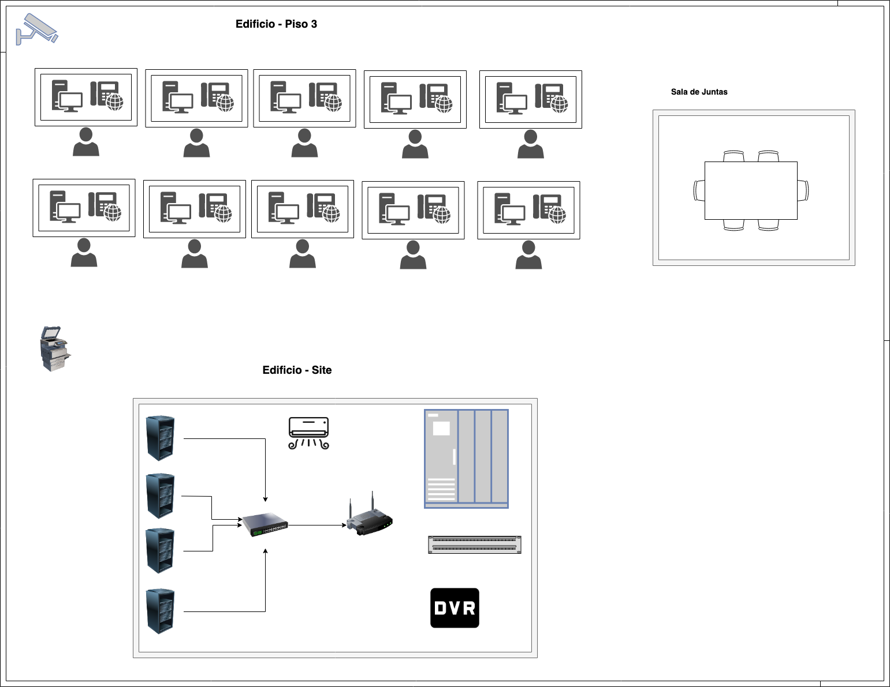
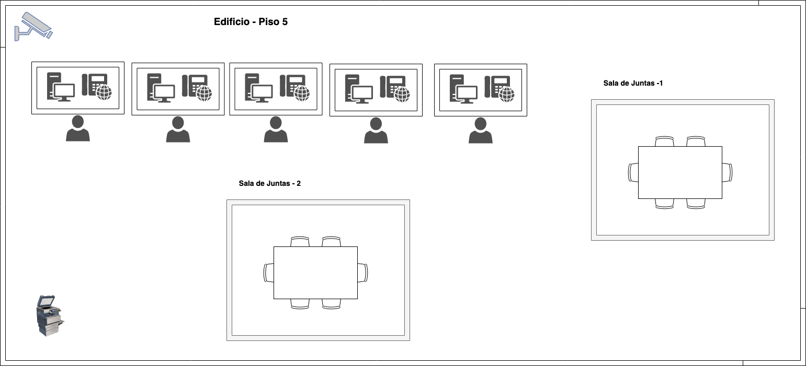
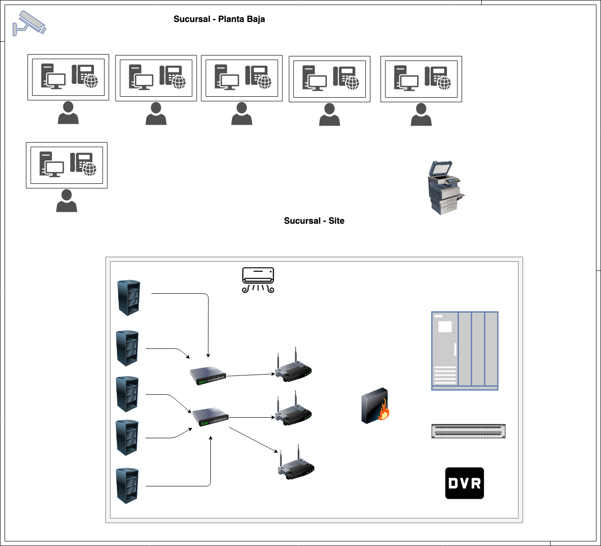
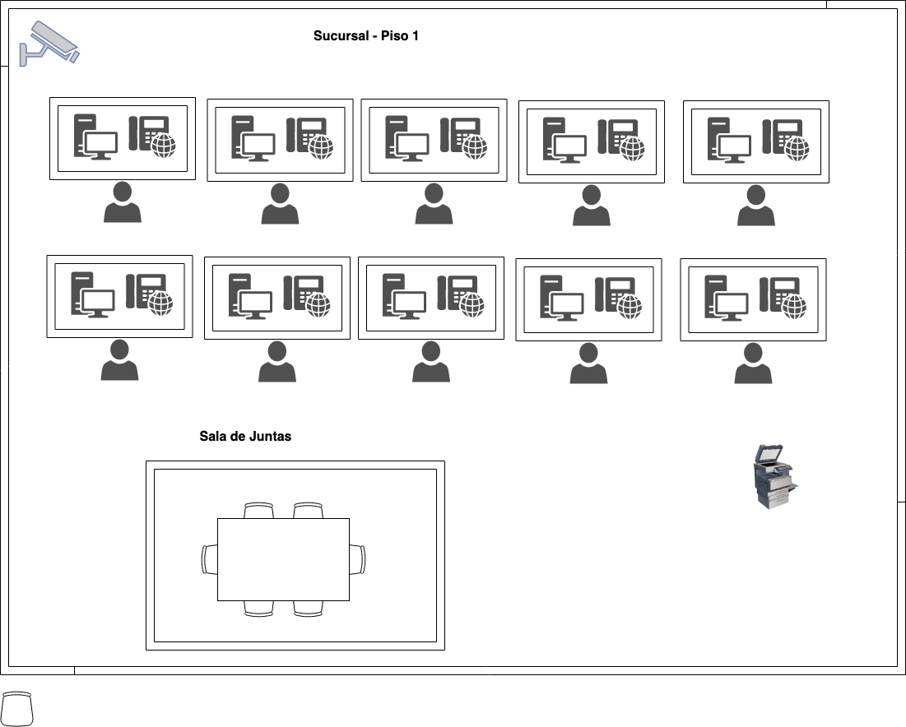
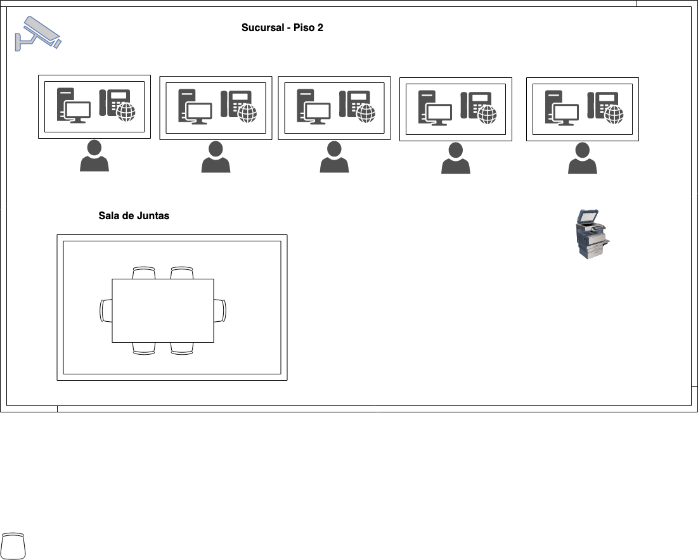

# Proyecto Cotización

## Informacion del Proyecto

- `Nombre de la empresa`: CiberSecurityMX
- `Descripcion de la empresa`: Somos una empresa que se destaca por ofrecer soporte en el area de ciber seguridad en diferentes ambientes
- `Mision`: Ayudar a los clientes para mantener un ambiente de software limpio de cualquier intrucion
- `Vision`: Ser la empresa #1 en latinoamerica lider en el ramo
- `Clientes`: Entre nuestros clientes distinguidos estan: Ran-Dos, Googler, Intelc, VPSCloud entre otros

## Duracion del proyecto

Este proyecto se prevee que dure un lapso entre 1 y 3 años

## Cotizaciones

Se hicieron cotizaciones para una empresa de giro telefonica. las cuales constan de dos partes, las cuales son:

- Edificio
- Sucursal

### Edificio

Esta cotizacion se divide en tres partes las cuales son:

- :ballot_box_with_check: Cotizacion del site (`hardware`)
- :ballot_box_with_check: Cotizacion del site (`software`)
- :ballot_box_with_check: Cotizacion del equipo general (`hardware`)

Dichas cotizaciones se pueden observar en el siguiente documento:   
:page_facing_up: [Documento de cotizacion del edificio](cotizaciones/edificio/Resumen.pdf)

Las especificaciones tecnicas se pueden visualizar en el siguiente documento:  
:page_facing_up: [Especificaciones Tecnicas](cotizaciones/edificio/Especificaciones.pdf)

### Sucursal

Esta cotizacion se divide en dos partes las cuales son:

- Cotizacion del site en la sucursal
- Cotizacion del equipo en la sucursal

Dichas cotizaciones se pueden observar en el siguiente documento:  
:page_facing_up: [Documento de cotizacion de la sucursal](cotizaciones/sucursal/Resumen.pdf)

Las especificaciones tecnicas se dividen en dos, las cuales son:

- :page_facing_up: [Especificaciones tecnicas para el site](cotizaciones/sucursal/EspecificacionesHardware.pdf)
- :page_facing_up: [Especificaciones tecnicas para el equipo en general](cotizaciones/sucursal/EspecificacionesEquipo.pdf)

## Caracteristicas

Para el edificio y la sucursal se realizaron documentos para describir las caracteristicas con las cuales se van a construir

### Edificio

En el siguiente documento se aprecian las caracteristicas para construir el edificio:

- :office: [Caracteristicas del edificio](caracteristicas/edificio/caracteristicasEdificio.pdf)

### Sucursal

En el siguiente documento se aprecian las caracteristicas para construir la sucursal:

- :office: [Caracteristicas de la sucursal](caracteristicas/edificio/caracteristicasSucursal.pdf)

## Diagramas

Se realizaron diagramas tanto como para el edificio asi como para la sucursal los cuales se detallan a continuacion

### Edificio

  
:point_right: Click aqui para mostrar el diagrama de la planta baja

  

  
:point_right: Click aqui para mostrar el diagrama de los pisos 1, 2 & 4

  

  
:point_right: Click aqui para mostrar el diagrama del piso 3

  

  
Click aqui para mostrar el diagrama del piso 5

  

### Sucursal

  
Click aqui para mostrar el diagrama de la planta baja

  

  
Click aqui para mostrar el diagrama del piso 1

  

  
Click aqui para mostrar el diagrama del piso 2

  

## Integrantes del Equipo

- Humberto Israel Perez Rodriguez
- Victor Hugo Robles Aguayo
- Daniel
- Ramon Villa Espinoza