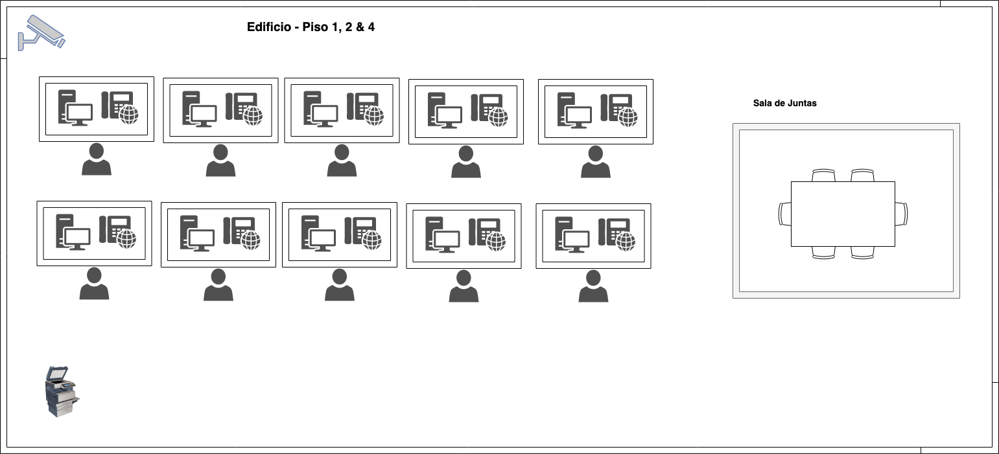

# Proyecto Cotización

## Cotizaciones

Se hicieron cotizaciones para una empresa de giro telefonica. las cuales constan de dos partes, las cuales son:

- Edificio
- Sucursal

### Edificio

Esta cotizacion se divide en tres partes las cuales son:

- Cotizacion del site (hardware)
- Cotizacion del site (software)
- Cotizacion del equipo general (hardware)

Dichas cotizaciones se pueden observar en el siguiente documento:
[Documento de cotizacion del edificio](cotizaciones/edificio/Resumen.pdf)

Las especificaciones tecnicas se pueden visualizar en el siguiente documento:
[Especificaciones Tecnicas](cotizaciones/edificio/Especificaciones.pdf)

### Sucursal

Esta cotizacion se divide en dos partes las cuales son:

- Cotizacion del site en la sucursal
- Cotizacion del equipo en la sucursal

Dichas cotizaciones se pueden observar en el siguiente documento:
[Documento de cotizacion de la sucursal](cotizaciones/sucursal/Resumen.pdf)

Las especificaciones tecnicas se dividen en dos, las cuales son:

- [Especificaciones tecnicas para el site](cotizaciones/sucursal/EspecificacionesHardware.pdf)
- [Especificaciones tecnicas para el equipo en general](cotizaciones/sucursal/EspecificacionesEquipo.pdf)

## Caracteristicas

Para el edificio y la sucursal se realizaron documentos para describir las caracteristicas con las cuales se van a construir

### Edificio

En el siguiente documento se aprecian las caracteristicas para construir el edificio:

- [Caracteristicas del edificio](caracteristicas/edificio/caracteristicasEdificio.pdf)

### Sucursal

En el siguiente documento se aprecian las caracteristicas para construir la sucursal:

- [Caracteristicas de la sucursal](caracteristicas/edificio/caracteristicasSucursal.pdf)

## Diagramas

Se realizaron diagramas tanto como para el edificio asi como para la sucursal los cuales se detallan a continuacion

### Edificio

  
Click aqui para mostrar el diagrama de la planta baja

  

  
Click aqui para mostrar el diagrama de los pisos 1, 2 & 4

 
  

